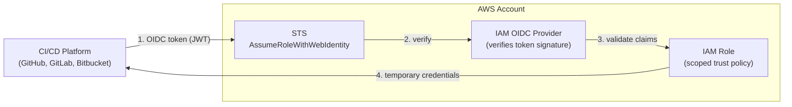

<!-- BEGIN_TF_DOCS -->
# AWS IAM OIDC Federation for CI/CD


---

Provisions AWS IAM resources to enable OIDC (OpenID Connect) federation between AWS and a CI/CD platform.
Creates an IAM OIDC identity provider and a scoped assumable IAM role. No policies are attached — callers attach their
own based on their use case.

## Architecture



## How OIDC federation works

Traditional CI/CD pipelines authenticate to AWS with long-lived access keys stored as secrets. OIDC eliminates those
credentials entirely:

1. The CI platform mints a short-lived, signed JWT (the OIDC token) for each job.
2. The job presents that token to AWS STS via `AssumeRoleWithWebIdentity`.
3. AWS verifies the token's signature against the registered OIDC provider and checks that the claims satisfy the
   role's trust policy.
4. STS returns temporary credentials (max 1 hour) scoped to that role.

No secrets to rotate. No credentials to leak. Compromise is bounded to a single job run.

## Usage

See the [`examples/`](./examples) directory for a working configuration per platform:

- [GitHub Actions](./examples/github)
- [GitLab CI](./examples/gitlab)
- [Bitbucket Pipelines](./examples/bitbucket)

### Multiple roles, single provider

AWS enforces one OIDC provider per URL per account. When you need multiple IAM roles for the
same platform (e.g., separate roles for different projects), create the provider once and reuse
it for subsequent role configurations.

```hcl
# First module call — creates both the OIDC provider and the first role.
module "oidc_deploy" {
  source = "app.terraform.io/my-org/terraform-aws-oidc-federation"

  platform     = "gitlab"
  match_values = ["project_path:my-group/deploy-project:ref_type:branch:ref:main"]
}

# Second module call — reuses the existing provider, creates a second role only.
module "oidc_preview" {
  source = "app.terraform.io/my-org/terraform-aws-oidc-federation"

  platform             = "gitlab"
  match_values         = ["project_path:my-group/preview-project:ref_type:branch:ref:main"]
  create_oidc_provider = false
  oidc_provider_arn    = module.oidc_deploy.provider_arn
}
```

### Attaching a custom policy

This module creates the role and trust relationship only. Attach permissions in the calling configuration using the
`role_name` output. CI pipelines typically need purpose-built policies rather than AWS managed ones — the exact
actions and resources will vary by use case.

```hcl
module "oidc" {
  source = "app.terraform.io/my-org/terraform-aws-oidc-federation"

  platform     = "gitlab"
  match_values = ["project_path:my-group/my-project:ref_type:branch:ref:main"]
}

data "aws_iam_policy_document" "deploy" {
  statement {
    effect    = "Allow"
    actions   = ["s3:PutObject", "s3:DeleteObject"]
    resources = ["arn:aws:s3:::my-deploy-bucket/*"]
  }
}

resource "aws_iam_policy" "deploy" {
  name   = "ci-deploy-policy"
  policy = data.aws_iam_policy_document.deploy.json
}

resource "aws_iam_role_policy_attachment" "deploy" {
  role       = module.oidc.role_name
  policy_arn = aws_iam_policy.deploy.arn
}
```

## Scoping access with match_values

The `match_values` list controls which tokens are allowed to assume the role. AWS evaluates them with `StringLike`,
so `*` wildcards are supported. Start as narrow as your use case allows and widen only when necessary.

| Scope | GitHub Actions example | GitLab CI example |
|---|---|---|
| Entire org / group | `repo:myorg/*` | `project_path:mygroup/*:*` |
| Single repo, any ref | `repo:myorg/myrepo:*` | `project_path:mygroup/myrepo:*` |
| Single repo, main branch | `repo:myorg/myrepo:ref:refs/heads/main` | `project_path:mygroup/myrepo:ref_type:branch:ref:main` |
| Single repo, tags only | `repo:myorg/myrepo:ref:refs/tags/*` | `project_path:mygroup/myrepo:ref_type:tag:ref:*` |

Providing multiple list entries lets more than one project or branch assume the same role without opening access to
the entire organisation.

> **Bitbucket users:** Bitbucket's `sub` claim uses UUIDs rather than human-readable names —
> `{workspace-uuid}:{repo-uuid}:*` — so the patterns above do not apply directly. There is no name-based wildcard
> that covers an entire workspace; you must supply the workspace UUID explicitly. To scope access to all repositories
> in a workspace, use `{workspace-uuid}:*`; to target a single repository, supply both UUIDs. Find your workspace
> UUID under **Workspace Settings → General** and your repository UUID under **Repository Settings → General** in
> the Bitbucket UI.

## Security considerations

- **Prefer `sub` over `aud` for `match_field`.** The audience claim (`aud`) is often shared across an entire
  organisation, so matching on it grants access to every repo in that org. The subject claim (`sub`) is job-scoped
  and is the safer default.
- **Avoid bare wildcards.** A `match_values` entry of `["*"]` would allow _any_ token issued by the platform to
  assume the role. Always include at least the org or group prefix.
- **Attach least-privilege policies.** This module creates the role without any permission policies. Attach only
  the actions and resources your pipeline actually needs.
- **One provider per account per URL.** AWS enforces uniqueness of OIDC provider URLs within an account. If a
  provider for the platform already exists, set `create_oidc_provider = false` and pass its ARN via
  `oidc_provider_arn` rather than creating a duplicate.

## Required tools

| Tool | Purpose |
|------|---------|
| [Terraform](https://developer.hashicorp.com/terraform/install) | Infrastructure as Code |
| [terraform-docs](https://terraform-docs.io/user-guide/installation/) | README generation |
| [TFLint](https://github.com/terraform-linters/tflint#installation) | Terraform linter |
| [Checkov](https://www.checkov.io/2.Basics/Installing%20Checkov.html) | Security / policy scanning |
| [Trivy](https://aquasecurity.github.io/trivy/latest/getting-started/installation/) | Vulnerability / secret scanning |
| [pre-commit](https://pre-commit.com/#installation) | Git hook manager |

> Once all tools are installed, run `make setup` to initialise pre-commit hooks, TFLint plugins,
> and the Terraform working directory.

## Requirements

| Name | Version |
|------|---------|
| <a name="requirement_terraform"></a> [terraform](#requirement\_terraform) | ~> 1.14 |
| <a name="requirement_aws"></a> [aws](#requirement\_aws) | ~> 6.27 |
| <a name="requirement_tls"></a> [tls](#requirement\_tls) | ~> 4.1 |
## Providers

| Name | Version |
|------|---------|
| <a name="provider_aws"></a> [aws](#provider\_aws) | ~> 6.27 |
| <a name="provider_tls"></a> [tls](#provider\_tls) | ~> 4.1 |
## Modules

No modules.
## Inputs

| Name | Description | Type | Default | Required |
|------|-------------|------|---------|:--------:|
| <a name="input_create_oidc_provider"></a> [create\_oidc\_provider](#input\_create\_oidc\_provider) | Whether to create the IAM OIDC identity provider. Set to false to reuse an existing provider. | `bool` | `true` | no |
| <a name="input_match_field"></a> [match\_field](#input\_match\_field) | The OIDC token claim used as the condition key in the IAM role trust policy.<br/>Use "sub" (subject) to scope access to specific repositories or projects — this<br/>is the recommended default. Use "aud" (audience) to scope by the token's intended<br/>recipient instead. The chosen field must be present in the tokens issued by the<br/>selected platform. | `string` | `"sub"` | no |
| <a name="input_match_values"></a> [match\_values](#input\_match\_values) | One or more patterns that the match\_field claim must satisfy (AWS StringLike).<br/>Wildcards (*) are supported. Platform-specific formats:<br/><br/>  GitHub Actions : ["repo:<org>/<repo>:ref:refs/heads/main"]<br/>  GitLab CI      : ["project\_path:<group>/<project>:ref\_type:branch:ref:main"]<br/>  Bitbucket      : ["{<workspace-uuid>}:{<repo-uuid>}:*"]<br/><br/>Providing multiple values allows more than one project or branch to assume the role. | `list(string)` | n/a | yes |
| <a name="input_oidc_provider_arn"></a> [oidc\_provider\_arn](#input\_oidc\_provider\_arn) | ARN of an existing IAM OIDC identity provider to reuse. Required when create\_oidc\_provider<br/>is false. Ignored when create\_oidc\_provider is true. AWS enforces one provider per URL per<br/>account; use this when the provider already exists. | `string` | `null` | no |
| <a name="input_platform"></a> [platform](#input\_platform) | The CI/CD platform to configure (github, gitlab, or bitbucket). | `string` | n/a | yes |
| <a name="input_role_name_prefix"></a> [role\_name\_prefix](#input\_role\_name\_prefix) | Prefix for the IAM role name. | `string` | `"OIDC-Assumable-Role-"` | no |
## Outputs

| Name | Description |
|------|-------------|
| <a name="output_provider_arn"></a> [provider\_arn](#output\_provider\_arn) | The ARN of the OIDC identity provider. |
| <a name="output_role_arn"></a> [role\_arn](#output\_role\_arn) | The ARN of the IAM role created for OIDC federation. |
| <a name="output_role_name"></a> [role\_name](#output\_role\_name) | The name of the IAM role created for OIDC federation. |
<!-- END_TF_DOCS -->